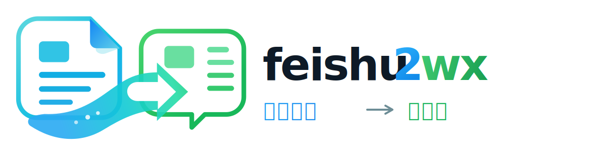

<div align="center">



# 飞书文档 → 微信公众号排版神器

**一个现代化的工具，帮助您快速将飞书文档转换为微信公众号文章格式。**

[](https://www.typescriptlang.org/)
[](https://reactjs.org/)
[](https://create-react-app.dev/)
[](https://github.com/markdown-it/markdown-it)
[](https://opensource.org/licenses/MIT)

</div>

## ✨ 功能特性

- 📋 **飞书文档直接粘贴** - 支持从飞书文档复制内容，自动转换为 Markdown 格式
- 🧠 **智能 Markdown 粘贴识别** - 从渲染后的 Markdown 页面复制内容时，会尽量还原为 Markdown，而不是退化成普通文本
- 📂 **本地文件导入** - 支持导入本地 `.md` 文件
- ✏️ **实时编辑预览** - 左侧编辑 Markdown 源码，右侧实时预览渲染效果，编辑器滚动时预览区自动联动同步
- 🎨 **4 种精美主题** - 内置 4 种主题（经典、橙色、蓝色、青绿），支持浅色/深色/跟随系统三种模式
- ⚙️ **排版设置面板** - 可视化设置面板，统一管理 H1 样式、分割线、表格阴影、图片模式、代码块样式
- ✅ **Task List 支持** - 支持 GFM 任务列表语法（`- [x]` / `- [ ]`），渲染为复选框
- 📝 **脚注支持** - 支持 Markdown 脚注语法（`[^1]` + `[^1]: 定义`），自动渲染为上标引用和脚注区块
- 📑 **文章大纲** - 编辑器底部大纲按钮解析 H1-H3 标题（跳过 frontmatter 与代码块），点击大纲项快速定位到对应标题
- 🧩 **文章首尾模板** - 在设置面板配置首尾模板，复制/推送时自动拼接到正文前后（frontmatter 之后、正文之前 / 正文之后）
- 🎨 **品牌色高亮** - 标题中"飞书文档"使用飞书主题色（#00BECA），"微信公众号"使用微信主题色（#07C160），提升视觉识别度
- 🔤 **字体选择** - 支持 16 种免费无版权字体，包括系统字体和 Google Fonts
- 📱 **设备预览切换** - 支持电脑和手机两种预览模式
- 👁️ **隐藏源码** - 可隐藏左侧编辑器，专注预览效果
- ⛶ **全屏预览** - 支持全屏预览模式，内容居中显示（60%宽度），电脑预览和手机预览模式优化，移除多余间隙，保持圆角样式
- 📝 **Markdown 工具栏** - 快速插入标题、列表、链接等常见元素
- 📋 **一键复制** - 一键复制格式化后的内容到微信公众号编辑器，保留所有样式
- ⌨️ **编辑器快捷键** - 支持 Ctrl/Cmd+B（粗体）、Ctrl/Cmd+I（斜体）、Ctrl/Cmd+U（下划线）、Ctrl/Cmd+K（链接）、Ctrl/Cmd+Z（自定义撤销，50 步历史）
- 👁️ **H1 底线切换** - 可隐藏/显示 H1 标题底部横线，满足不同排版需求
- 🏷️ **H1 反显切换** - 可为 H1 标题开启主色背景反显，背景宽度随文本自适应，复制公众号后保持居中
- 🖼️ **图片样式切换** - 支持边框模式和阴影模式，灵活调整图片视觉效果
- 💻 **代码语法高亮** - 支持代码块语法高亮，使用 Atom One Dark 主题，显示语言标签
- 🎨 **精美样式** - 优化的代码块、引用、表格等元素样式，提供更好的阅读体验
- 🎯 **响应式设计** - 完美适配桌面和移动设备
- 💻 **纯前端实现 + 后端推送** - 核心功能无需后端服务，推送草稿箱功能由 Cloudflare Functions 代理微信 API
- 🔐 **公众号配置** - 支持配置微信公众平台 AppID 和 AppSecret，直接推送到公众号草稿箱
- 👥 **多用户支持** - 每个用户可自行配置自己的公众号凭证，凭证保存在浏览器本地，互不干扰

## 🚀 快速开始

### 环境要求

- Node.js >= 14.0.0
- npm >= 6.0.0

### 安装步骤

1. **克隆或下载项目**

```bash
cd feishu2wx
```

2. **安装依赖**

```bash
npm install
```

3. **启动应用**

```bash
npm run dev
```

应用将在 `http://localhost:3100` 启动，并同时启动后端服务 `http://localhost:3101`

> 💡 **提示**：如果只使用排版和预览功能，可以运行 `npm start` 仅启动前端。推送到微信草稿箱必须使用 `npm run dev` 或部署到 Cloudflare。

## 📖 使用说明

### 基本使用

1. **粘贴飞书文档内容**

    - 在飞书文档中选择并复制内容（Ctrl+C / Cmd+C）
    - 在左侧编辑区域粘贴（Ctrl+V / Cmd+V）
    - 系统会自动将 HTML 格式转换为 Markdown
    - 如果复制来源是渲染后的 Markdown 页面，而 `text/plain` 已经丢失 Markdown 语法，编辑器会优先根据剪贴板中的 HTML 结构还原标题、列表和代码块
    - 粘贴检测逻辑在 `src/utils/pasteDetection.ts` 中实现，支持飞书/Lark 标记、HTML 表格、渲染后 Markdown 等多种检测条件
    - 如果遇到来源 HTML 中包含 `data-lark`、`larksuite`、`feishu.cn` 等关键词导致误判，可以在设置面板里关闭”智能 HTML 转 Markdown”

2. **编辑 Markdown**

    - 直接在左侧编辑区域修改 Markdown 源码
    - 右侧会实时显示渲染后的效果

3. **插入图片**

    - 使用 Markdown 格式：``
    - 图片需要是公开可访问的 URL
    - 预览层会保留语义化图片结构；复制到公众号时，带说明文字的图片会自动降级为更稳妥的 `section + img + p` 结构，避免依赖 `figure/figcaption`

4. **切换主题**

    - 点击顶部主题选择器（位于第二行工具栏）
    - 选择您喜欢的主题风格（4 种主题可选）
    - 明亮和暗黑主题会自动跟随系统暗黑模式设置
    - 主题按钮横向排列，支持横向滚动查看

5. **使用设置面板**

    - 点击右上角设置按钮打开排版设置面板
    - 统一管理：字体、H1 样式（底线/反色/对齐）、分割线、表格阴影、图片模式、代码块样式

6. **选择字体**

    - 点击顶部字体下拉选择器
    - 选择您喜欢的字体（16 种免费无版权字体可选）
    - 字体会在预览和复制公众号时生效

7. **隐藏/显示源码**

    - 点击”隐藏源码”按钮可隐藏左侧编辑器
    - 再次点击”显示源码”可重新显示编辑器

8. **全屏预览**

    - 点击”全屏预览”按钮进入全屏模式
    - 电脑预览模式：内容以 60%宽度居中显示，隐藏预览效果栏，移除多余间隙
    - 手机预览模式：内容以合理宽度（420px）居中显示，移除边框，保持圆角样式
    - 按 ESC 键或点击”退出全屏”按钮退出

9. **切换预览模式**

    - 点击”电脑”或”手机”按钮
    - 查看不同设备下的显示效果

10. **H1 底线切换**

    - 点击"隐藏 H1 底线"按钮可隐藏 H1 标题底部的横线
    - 点击"显示 H1 底线"按钮可重新显示 H1 标题底部横线
    - 此设置会影响预览和复制公众号的效果

11. **H1 反显切换**

    - 点击"开启 H1 反显"按钮可为 H1 标题启用反显样式
    - 反显背景使用当前主题主色，宽度会随标题文本自适应
    - 复制公众号后会保持居中对齐

12. **图片样式切换**

    - 点击"边框模式"按钮可切换为图片边框样式
    - 点击"阴影模式"按钮可切换为图片阴影样式
    - 边框模式：图片带有淡灰色边框（0.5px #e0e0e0）
    - 阴影模式：图片带有柔和阴影效果
    - 此设置会影响预览和复制公众号的效果

13. **表格阴影切换**

    - 在设置面板中切换表格阴影显示/隐藏

14. **配置公众号（推送草稿箱）**

    - 点击右上角设置按钮 → 点击"去配置"按钮
    - 输入微信公众号的 AppID 和 AppSecret（可在 [微信公众平台](https://mp.weixin.qq.com) 获取）
    - 配置信息保存在浏览器本地，仅你自己可见
    - 配置完成后，点击"推送"按钮可将文章直接推送到公众号草稿箱
    - 支持设置文章标题、作者和封面图片
    - 文章标题自动填充：优先读取 front matter 的 `title` 字段，其次取正文首个 H1，均为空时显示"未命名文章"

15. **复制到公众号**

    - 编辑完成后，点击"复制"按钮，一键复制到公众号
    - 如果在右侧预览区域**选中了部分内容**，将仅复制选中部分
    - 如果**未选中任何内容**，则会复制整篇文章
    - 打开微信公众号编辑器后，按 Ctrl+V (Windows) 或 Cmd+V (Mac) 粘贴
    - 主题、字体、代码高亮等样式会尽可能通过内联样式完整保留
    - 微信导出默认使用保守标签子集：`p`、`span`、`strong/b`、`em/i`、`u`、`ul/ol/li`、`a`、`img`、`section`、`blockquote`、`h1-h6`、`table/tr/th/td`、`hr`、`sup/sub`
    - `figure`、`figcaption`、复杂布局标签和脚本标签不作为微信稳定能力依赖，导出链路会优先降级或过滤

### 多用户使用

本工具支持多用户共用同一个在线版本：

- **访问地址**：直接使用在线版本（替换为你的部署地址）
- **各自配置**：每个用户可在设置中配置自己的公众号 AppID 和 AppSecret
- **数据隔离**：凭证仅保存在各自浏览器本地，互不干扰，不经过任何服务器存储
- **无需部署**：无需克隆项目或部署后端，开箱即用

### Markdown 工具栏

编辑器底部提供了快速插入 Markdown 语法的工具栏和样式控制：

**快速插入：**
- **📄 加载示例** - 加载示例 Markdown 内容
- **🗑️ 清空** - 清空编辑器内容
- **👁️/📝 H1 底线** - 切换 H1 标题底部横线显示/隐藏
- **🎨/🎛️ H1 反显** - 切换 H1 标题主色反显效果
- **➖ 分割线** - 切换水平分割线显示/隐藏
- **🖼️/🌫️ 图片样式** - 切换图片边框模式/阴影模式
- **⬛/🔲 代码块样式** - 切换极简代码块/现代代码块
- **📋 一键复制公众号** - 复制格式化后的内容到微信公众号

**Markdown 语法：**
- **H1, H2, H3** - 插入标题
- **B, I, U** - 粗体、斜体、下划线
- **Code** - 行内代码（渲染后显示为加粗）
- **• List, 1. List** - 无序列表、有序列表
- **Quote** - 引用块
- **Link, Image** - 链接、图片
- **代码块样式切换**（工具栏中）：在经典浅色代码块和带 3 个圆点头部的现代深色代码块之间切换

### Markdown 渲染特性

- **代码块语法高亮** - 支持多种编程语言的语法高亮，使用 Atom One Dark 主题
- **代码块语言标签** - 自动显示代码块的语言类型
- **行内代码加粗** - 行内代码（`` `code` ``）渲染后显示为加粗样式
- **Task List** - 支持 GFM 任务列表语法（`- [x]` / `- [ ]`），渲染为 ☑/☐ 复选框
- **脚注** - 支持 Markdown 脚注语法（`[^1]` + `[^1]: 定义`），渲染为上标引用和脚注区块
- **Front Matter 预览** - YAML front matter（`---...---`）会在网页预览中展示为元数据卡片，复制和推送到公众号时自动剥离
- **Front Matter 标题提取** - 推送草稿箱时自动读取 front matter 的 `title` 字段填充文章标题（无则回退到正文首个 H1），并读取 `cover` 字段填充封面
- **优化的标题间距** - H1 和 H2 标题具有更大的上边距（第一个 H1 除外）
- **字体大小优化** - H1: 24px, H2: 18px, P: 16px
- **引用块优化** - 引用元素的上下 padding 保持一致
- **表格支持** - 支持 Markdown 表格，在移动端可横向滚动查看

## 🎨 主题说明

### 经典主题（默认）🖤

经典黑白风格，适合正式文章，是应用启动时的默认主题。

### 橙色主题 🧡

活力橙色风格，适合活动、促销类文章

### 蓝色主题 💙

清新蓝色风格，适合商务、专业类文章

### 青绿主题 💚

清新绿色风格，适合科技类、自然类文章

## 🔤 字体说明

支持 16 种免费无版权字体，包括：

- **系统默认字体** - 使用系统默认字体栈
- **中文字体** - 微软雅黑、宋体、黑体
- **英文字体** - Arial、Helvetica、Times New Roman、Georgia、Verdana、Courier New
- **Google Fonts** - Roboto、Open Sans、Lato、Montserrat、Raleway、Poppins

所有字体均为免费无版权，可放心使用。

## 📁 项目结构

```
feishu2wx/
├── public/                 # 静态资源
│   ├── index.html          # HTML 模板（包含 Google Fonts）
│   ├── favicon.svg         # 浏览器标签图标
│   ├── logo.svg            # 项目 Logo
│   └── 404.html            # GitHub Pages 路由重定向
├── src/
│   ├── components/         # React 组件
│   │   ├── EditorPane.tsx         # 编辑器面板
│   │   ├── PreviewPane.tsx        # 预览面板
│   │   ├── ThemeSwitcher.tsx      # 主题切换器
│   │   ├── FontSelector.tsx       # 字体选择器
│   │   ├── DevicePreviewToggle.tsx # 设备预览切换
│   │   ├── SettingsPanel.tsx      # 排版设置面板
│   │   ├── Toolbar.tsx            # 工具栏
│   │   ├── ShortcutsDrawer.tsx    # 快捷键抽屉面板
│   │   ├── ImageViewer.tsx        # 图片查看器
│   │   ├── PublishDialog.tsx      # 推送对话框
│   │   └── WechatConfigDialog.tsx # 公众号配置对话框
│   ├── data/                # 数据文件
│   │   └── example.ts             # 示例 Markdown 内容
│   ├── utils/              # 工具函数
│   │   ├── htmlToMarkdown.ts      # HTML 转 Markdown
│   │   ├── markdownRenderer.ts    # Markdown 渲染
│   │   ├── wechatCopy.ts          # 微信公众号复制
│   │   ├── codeBlockStyles.ts     # modern 代码块样式参数
│   │   ├── pasteDetection.ts      # 智能粘贴检测
│   │   ├── publishApi.ts          # 推送草稿箱 API
│   │   ├── wechatTagWhitelist.ts  # 微信标签白名单
│   │   ├── coverCanvas.ts         # 封面图生成
│   │   └── helper.ts              # 工具函数
│   ├── styles/             # 样式文件
│   │   ├── themes.css      # 主题样式
│   │   └── tokens.css      # 设计 Token
│   ├── types/              # 类型声明
│   ├── App.tsx             # 主应用组件
│   ├── App.css             # 主应用样式
│   └── index.tsx           # 入口文件
├── package.json            # 项目依赖
├── README.md               # 项目说明
├── QUICKSTART.md           # 快速启动指南
└── DEPLOY.md               # 部署指南
```

## 🛠️ 技术栈

### 前端

- React 18
- TypeScript
- Create React App
- Markdown-it (Markdown 渲染)
- markdown-it-footnote (脚注插件)
- Turndown + turndown-plugin-gfm (HTML 转 Markdown)
- Highlight.js (代码语法高亮，Atom One Dark 主题)
- Google Fonts (字体支持)

## 📝 开发说明

### 开发模式

开发模式（热重载）：

```bash
npm run dev
```

只开发排版/预览等纯前端功能时，也可以运行 `npm start`。

### 构建生产版本

```bash
npm run build
```

构建后的文件在 `build` 目录中。

## 🚀 部署到 GitHub Pages

本项目支持部署到 GitHub Pages，有两种部署方式：

### 方式一：使用 GitHub Actions（推荐）

项目已配置 GitHub Actions 工作流，每次推送到 `main` 分支时会自动构建并部署到 GitHub Pages。

**部署步骤：**

1. **启用 GitHub Pages**

   - 进入 GitHub 仓库设置页面
   - 点击左侧 "Pages" 菜单
   - 在 "Source" 中选择 "GitHub Actions"
   - 保存设置

2. **推送代码**

   ```bash
   git add .
   git commit -m "准备部署到 GitHub Pages"
   git push origin main
   ```

3. **查看部署状态**

    - 在 GitHub 仓库中，点击 "Actions" 标签页
    - 查看部署工作流的执行状态
    - 部署成功后，访问 `https://你的用户名.github.io/你的仓库名`

### 方式二：使用 gh-pages 手动部署

如果需要手动部署，可以使用以下命令：

```bash
npm run deploy
```

这会自动构建项目并将 `build` 目录部署到 `gh-pages` 分支。

**注意事项：**

- 首次部署前，确保在 GitHub 仓库设置中启用 GitHub Pages
- 如果使用自定义域名，需要修改 `package.json` 中的 `homepage` 字段
- 部署后可能需要几分钟才能访问到最新版本

## ⚙️ 配置说明

### 前端配置

`npm start` 默认运行在 `3000` 端口；`npm run dev` / `npm run cf:dev` 通过 `PORT=3100` 启动前端。

如需修改端口，编辑 `package.json` 中的 `scripts.start` 字段，例如：

```bash
PORT=3001 react-scripts start
```

### GitHub Pages 配置

如果您的 GitHub 用户名或仓库名不同，需要修改 `package.json` 中的 `homepage` 字段：

```json
"homepage": "https://你的用户名.github.io/你的仓库名"
```

### 字体配置

字体通过 Google Fonts 加载，在 `public/index.html` 中配置。如需添加或修改字体，请编辑该文件中的 Google Fonts 链接。

## 🐛 常见问题

### 1. 复制公众号失败

- 确保浏览器允许剪贴板访问权限
- 尝试手动选择右侧预览内容并复制
- 某些浏览器可能需要 HTTPS 环境才能使用剪贴板 API
- 如果自动复制失败，可以手动选择预览区域内容，按 Ctrl+C (Windows) 或 Cmd+C (Mac) 复制

### 2. 飞书内容粘贴后格式不正确

- 确保从飞书文档中完整复制内容
- 某些复杂格式可能需要手动调整
- 可以尝试先粘贴到纯文本编辑器，再复制到本工具

### 3. 图片显示问题

- 图片需要使用 Markdown 格式：``
- 确保图片 URL 是公开可访问的
- 建议使用图床服务（如 GitHub、Imgur 等）托管图片

### 4. 字体不生效

- 确保网络连接正常（Google Fonts 需要联网加载）
- 某些字体可能需要等待加载完成
- 系统字体会立即生效，无需等待

### 5. 主题样式在微信公众号中不显示

- 确保使用"一键复制公众号"功能
- 手动复制可能无法保留样式
- 复制后检查微信公众号编辑器是否支持富文本格式

### 6. 代码块显示问题

- 代码块支持语法高亮，会自动识别语言类型
- 如果语言识别失败，会显示为 "CODE" 标签
- 代码块使用深色主题（Atom One Dark），提供更好的代码阅读体验
- 行内代码会显示为加粗样式，便于区分

## 🔒 安全说明

### 公众号凭证存储

公众号 AppID 和 AppSecret **仅保存在用户浏览器的 localStorage 中**，不经过任何服务端持久化存储。每次推送草稿箱时，凭证随请求发送到后端，后端仅用于调用微信 API，不做存储。

### 自托管安全建议

如果你计划自托管本项目，请注意以下安全配置：

1. **限制 CORS 来源**：通过环境变量 `ALLOWED_ORIGIN` 设置允许的前端域名，避免使用默认的 `*`（允许所有来源）。例如：
   ```bash
   # Cloudflare Pages 环境变量
   ALLOWED_ORIGIN=https://your-domain.com
   ```

2. **使用 HTTPS**：确保你的部署地址使用 HTTPS，防止凭证在传输中被截获。

3. **IP 白名单**：在微信公众平台 → 设置与开发 → 基本配置 中，将你的服务器 IP 添加到白名单。

4. **Cloudflare 部署**：推荐使用 Cloudflare Pages 部署，API 请求通过 Cloudflare Functions 代理，无需自建服务器，减少攻击面。

### 前端凭证模型

推送草稿箱流程中，AppSecret 存在于：
- **浏览器 localStorage**（用户主动输入后保存）
- **到后端的 HTTPS 请求体**（仅推送时发送）

这意味着你的后端代理会短暂接触到 AppSecret。在自托管场景下，后端是你自己控制的，这是可接受的。但请确保：
- 不要在公共网络上部署不加密的后端
- 不要将包含凭证的日志输出到公共位置

## 📄 许可证

本项目采用 MIT License 许可证。

## 🤝 贡献

欢迎提交 Issue 和 Pull Request！

## 📮 反馈

如有问题或建议，欢迎反馈。

---

**享受写作的乐趣！** ✨
**如果这个项目对您有帮助，请给个 ⭐ Star！**

Made with ❤️ by feishu2wx Contributors

<a href="https://github.com/wangruofeng/feishu2wx/graphs/contributors">
  
</a>

</div>
