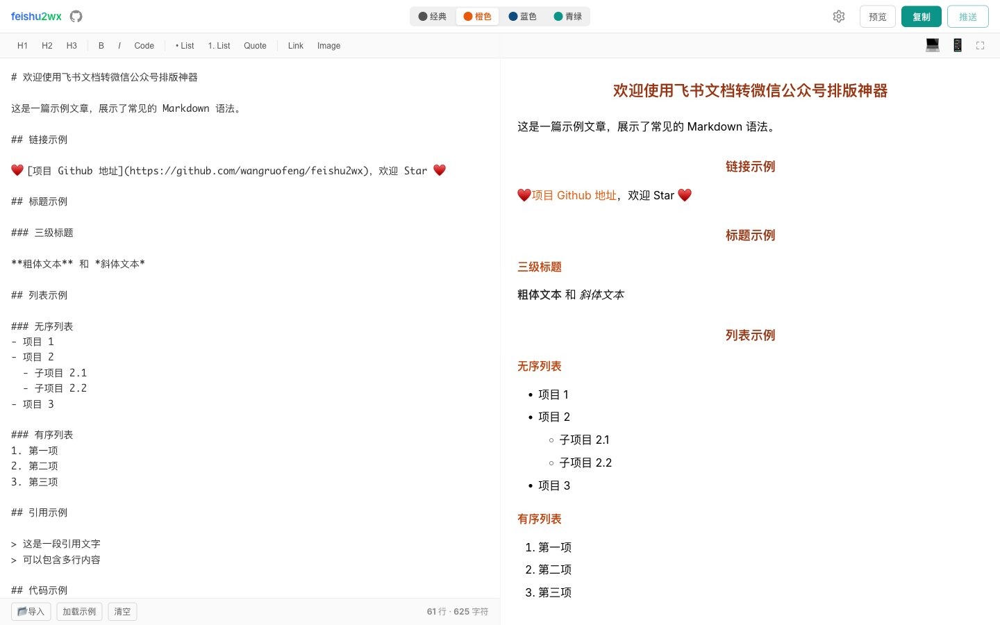
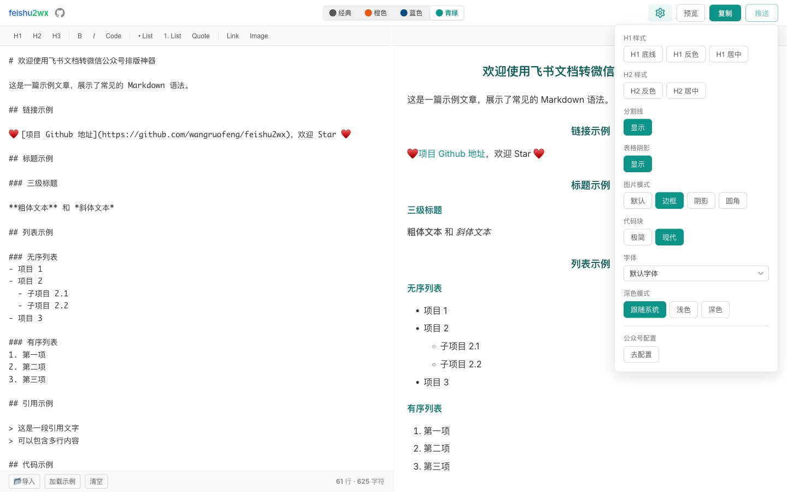
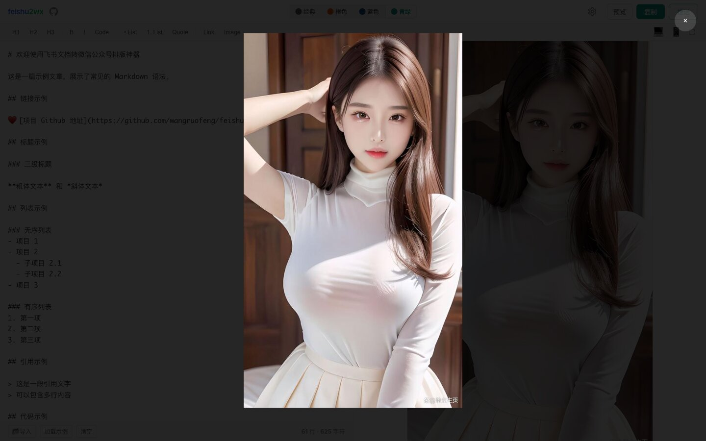
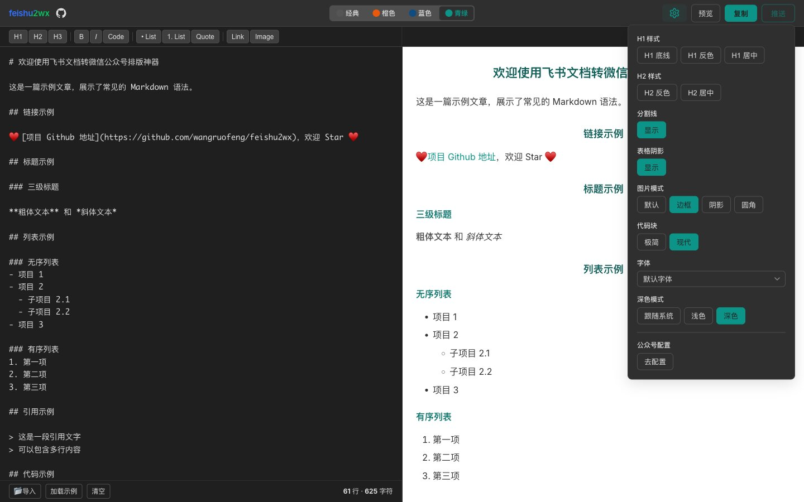
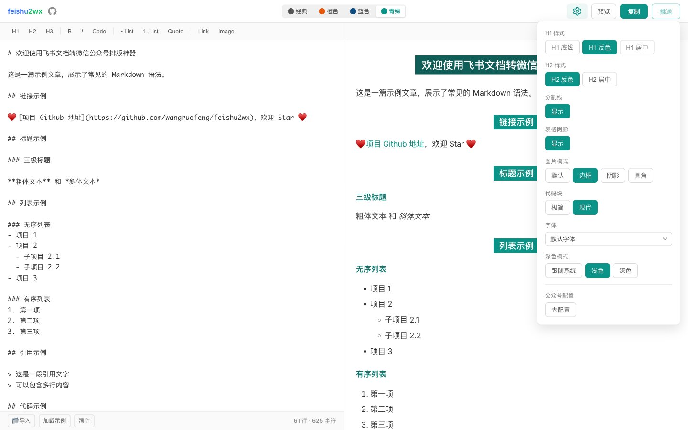
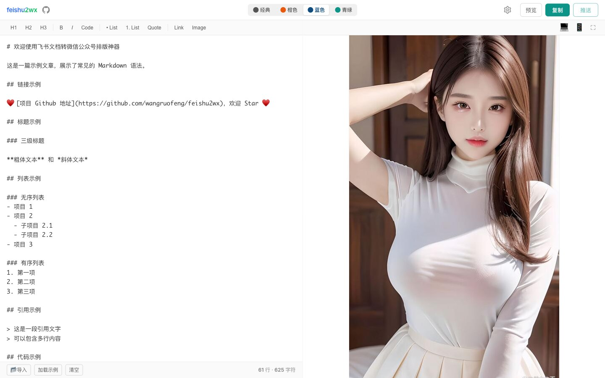
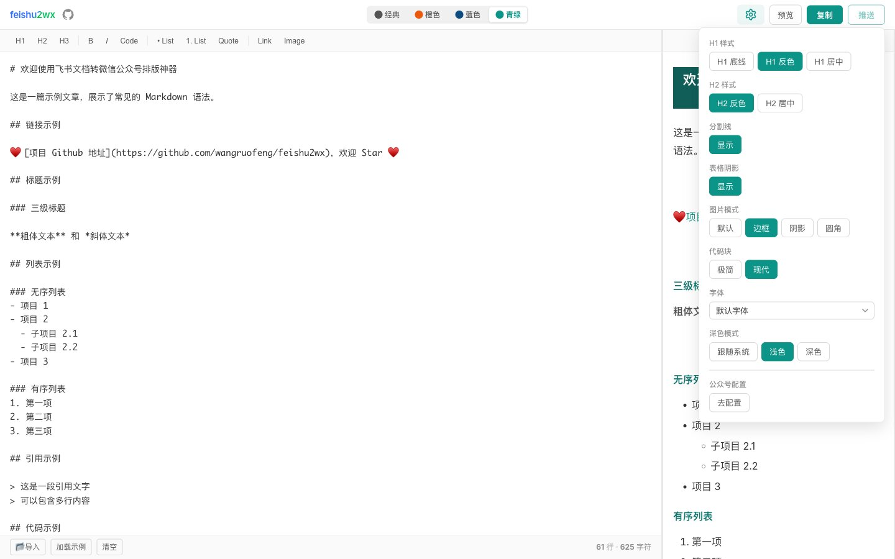

# 飞书转微信公众号排版工具：从零到一的技术实践

> 一个将飞书文档一键转换为微信公众号排版格式的开源工具，支持实时预览、多主题切换、一键复制，并可直推微信草稿箱。

## 背景

微信公众号编辑器对排版有诸多限制：不支持外部 CSS、不兼容 SVG、对代码块和表格的渲染极其简陋。而飞书作为团队协作的主流工具，积累了大量优质内容，如何把这些内容高效地搬运到公众号，同时保持良好的排版效果，就是 feishu2wx 要解决的问题。

项目地址：[github.com/wangruofeng/feishu2wx](https://github.com/wangruofeng/feishu2wx)

在线体验：[blog.wangruofeng007.com/feishu2wx](https://blog.wangruofeng007.com/feishu2wx/)


## 核心功能

### 智能粘贴转换

编辑器会自动检测粘贴内容是否来自飞书——通过识别剪贴板 HTML 中的 `feishu`、`larksuite`、`lark` 等标记。命中时走 HTML 转 Markdown 专用的转换规则（基于 Turndown + GFM 插件），否则回退为纯文本处理。这套规则针对飞书特有的代码块、高亮标记（`==text==`）、表格等做了特殊适配。

### 实时预览

编辑区和预览区左右分栏，滚动位置按比例同步映射。Markdown 经过 markdown-it 渲染为 HTML，代码块通过 highlight.js 实现语法高亮（Atom One Dark 主题），支持两种风格：

- **Classic**：极简浅色背景
- **Modern**：深色代码窗口样式，带三色圆点头部

### 主题与排版控制



提供 4 套主题（青绿、经典、橙色、蓝色），每套主题有完整的配色方案覆盖 H1-H6、引用块、链接、表格等元素。排版层面提供了细粒度的控制选项：

- H1/H2 样式：底线开关、反色（主题色背景 + 白色文字）、居中/左对齐
- 图片样式：默认/边框/阴影三种模式，支持圆角开关
- 代码块风格：经典/现代切换
- 表格阴影、水平分割线等开关



### 图片查看器

预览区的图片支持点击放大查看。查看器自动收集当前文章内的所有图片，支持键盘左右箭头切换浏览，底部显示序号（如 `2 / 5`）。图片加载失败时会显示带图标占位符，而不是浏览器默认的破碎图标。



### 一键复制到微信

这是整个工具最核心也最复杂的部分。微信公众号编辑器只认内联样式，不加载任何外部 CSS，所以需要把所有样式"烘焙"到每个 HTML 元素的 `style` 属性上。

复制采用三级回退策略，确保在不同浏览器环境下都能工作：

1. Clipboard API + ClipboardItem（现代浏览器）
2. execCommand + contenteditable div（兼容方案）
3. textarea 回退（最终兜底）

另外还支持智能选区复制：如果用户在预览区选中了部分内容，只复制选中部分；否则复制全文。

### 推送微信草稿箱

配置公众号 AppID/AppSecret 后，可以直接将文章推送到微信草稿箱。推送流程：

```
前端 localStorage → POST /api/publish/draft { appId, appSecret, ... }
                    ↓
    Cloudflare Functions → 微信 API（access_token → 上传图片 → 创建草稿）
```

凭证存储在用户浏览器的 localStorage 中，每次推送时随请求发送到后端，不经过任何服务端持久化存储。

## 技术架构

### 整体数据流

```
飞书 HTML 粘贴 → convertHtmlToMarkdown() → Markdown 状态
                                              ↓
                              renderMarkdown() → HTML 预览
                                              ↓
                              formatForWeChat() → 内联样式 HTML → 剪贴板
```

整个过程是纯函数式的数据变换管道，没有引入 Redux 之类的状态管理库——所有状态集中在 `App.tsx` 中，通过 React 的 `useState` 管理，并自动持久化到 localStorage（键名前缀 `feishu2wx_`）。

### 关键模块职责

| 模块 | 职责 |
|------|------|
| `htmlToMarkdown.ts` | 飞书 HTML 转 Markdown（Turndown + GFM） |
| `markdownRenderer.ts` | Markdown 转预览 HTML（markdown-it + highlight.js） |
| `wechatCopy.ts` | 预览 HTML 转微信兼容内联样式 HTML 并复制 |
| `codeBlockStyles.ts` | Modern 代码块的共享样式参数 |
| `publishApi.ts` | 推送草稿箱 API + localStorage 凭证管理 |

### 组件结构

```
App.tsx            主容器，状态中心
├── EditorPane      编辑区（飞书粘贴检测、本地 .md 导入、快捷键、自定义撤销）
├── PreviewPane     预览区（设备宽度切换、全屏、图片查看器）
├── Toolbar         底部工具栏（示例、清空、排版开关、一键复制）
├── ThemeSwitcher   主题切换（4 套主题）
├── FontSelector    字体选择（16 种字体）
├── SettingsPanel   设置面板（H1/H2 样式、图片、代码块、主题模式、公众号配置）
├── ImageViewer     图片查看器（键盘导航）
├── PublishDialog   推送对话框（标题、作者、封面）
└── WechatConfigDialog  公众号配置对话框
```

### 微信兼容性的技术难点

微信公众号编辑器的限制远不止"不支持外部 CSS"这么简单，实际踩过的坑包括：

**所有样式必须内联**——这是最基本的约束。`formatForWeChat()` 会遍历 DOM 树，为每个元素注入完整的内联样式。代码块的语法高亮通过 highlight.js 生成的类名映射到对应的内联颜色。

**单位只能用 px**——微信编辑器会吞掉 `em`、`rem`、`vh` 等单位，所以所有尺寸都显式转换为 `px`。

**图片必须上传到微信 CDN**——微信编辑器会过滤外部图片链接。推送草稿箱时，后端需要先上传所有图片到微信素材库，再将 HTML 中的 URL 替换为微信 CDN 地址。SVG 不被支持，需要在客户端先通过 Canvas 光栅化为 PNG。

**列表格式化会被吃掉**——微信编辑器会重排 `<li>` 内的结构。对策是为 `<li>` 内容额外包裹 `<span>`，对 `<p>` 标签做扁平化处理，列表内的粗体标签转为 styled span。

**复制到剪贴板后的格式丢失**——微信编辑器粘贴时会进行二次格式化。三级剪贴板回退策略就是为了在这个环节尽可能保真。

### 主题系统

主题配置分散在三处，修改时必须同步更新：

1. **`ThemeSwitcher.tsx`**：UI 层的主题按钮定义
2. **`wechatCopy.ts`**：`getThemeStyles()` 函数，返回各元素的内联样式值
3. **`styles/themes.css`**：预览区的 CSS 样式

同样，字体配置也需要在 `FontSelector.tsx`（UI）和 `wechatCopy.ts`（导出映射）之间保持同步。

### 设计 Token

UI 框架层使用 CSS 自定义属性作为设计 token，定义在 `tokens.css` 中：

```css
--color-brand: #0D9488;        /* 品牌色（青绿） */
--color-accent: #EA580C;       /* 强调色（橙色） */
--color-status-success: #07C160; /* 微信绿 */
--font-family-sans: 'Inter', 'PingFang SC', 'Microsoft YaHei', sans-serif;
```

暗黑模式通过 `.theme-dark` 类覆盖 token 值实现，不影响预览区的文章主题。



## 部署方案

项目采用双通道部署策略，兼顾纯前端和全栈两种场景：

### GitHub Pages（纯前端）

```yaml
# .github/workflows/deploy.yml
触发条件：push to main
构建：npm run build（注入 REACT_APP_API_URL 指向 Cloudflare 后端）
部署：actions/deploy-pages@v4
地址：wangruofeng.github.io/feishu2wx
```

纯静态部署，不包含推送草稿箱的后端 API。适合只使用排版和复制功能的用户。

### Cloudflare Pages（全栈）

```yaml
# .github/workflows/deploy-cloudflare.yml
触发条件：push to main
构建：npm run build
部署：wrangler pages deploy
后端：functions/api/publish/draft.ts（Cloudflare Functions）
地址：feishu2wx-b4h.pages.dev
```

Cloudflare Functions 处理微信 API 的代理请求（获取 access_token、上传图片、创建草稿）。两个部署通道共享同一个前端代码，GitHub Pages 版本通过构建时注入的环境变量访问 Cloudflare 上的后端 API。

## 开发体验

项目支持三种本地启动模式：

```bash
# 纯前端启动（端口 3100）
npm start

# 前端 + Express 后端（端口 3100 + 3101）
npm run dev

# 前端 + Cloudflare Functions 本地模拟
npm run cf:dev
```

`npm run dev` 模式下，CRA 通过 `setupProxy.js` 将 `/api` 请求代理到 Express 后端；`npm run cf:dev` 模式下则由 Wrangler 代理并处理 `functions/` 下的 Cloudflare Functions，通过 `CF_DEV=1` 环境变量跳过 CRA 代理避免冲突。

提交前有 Husky 钩子检查：版本号必须更新，源码变更通常需要同步更新文档。

## 技术栈

| 类别 | 技术选型 |
|------|---------|
| 前端框架 | React 18 + TypeScript |
| 构建工具 | Create React App 5 |
| Markdown 渲染 | markdown-it + markdown-it-footnote |
| HTML 转 Markdown | Turndown + turndown-plugin-gfm |
| 代码高亮 | highlight.js（Atom One Dark） |
| 后端（本地） | Express + ts-node |
| 后端（生产） | Cloudflare Functions |
| 部署 | GitHub Pages + Cloudflare Pages |
| CI/CD | GitHub Actions |

没有使用 Vite、Next.js 或任何 CSS-in-JS 方案——对于这个体量的工具应用，CRA + 纯 CSS 已经足够，保持技术栈的简单性也是刻意的。

## v1.15 更新内容

近期版本（v1.15.x）带来了一批功能更新和架构优化：

### 新增图片查看器

点击预览区图片可全屏查看，自动收集文章内所有图片，支持键盘左右箭头切换，底部显示图片序号。加载失败的图片会显示带图标的占位符。

### H2 样式配置

新增 H2 反色（主题色背景 + 白字）和 H2 居中/左对齐切换，与 H1 样式形成对称的排版能力。H2 的内部文本自动包裹 `<span class="h2-inline-block">`，与 H1 采用相同的实现模式。



### 主题体系重构

将原来的 10 套主题精简为 4 套（青绿、经典、橙色、蓝色），移除了使用率较低的主题。原"绿意"主题重命名为"青绿"，并更新了配色。品牌主色从蓝色系（`#4A7FE0`）切换为青绿色系（`#0D9488`）。

暗黑模式从主题列表中独立出来，成为单独的开关——现在可以同时选择"青绿主题 + 深色界面"，之前暗黑模式是作为一个独立主题存在的，无法与配色主题组合。





### 字体更新

默认英文字体从 Source Sans Pro 更换为 Inter，等宽字体栈加入 JetBrains Mono。

### 开发体验改进

新增 `setupProxy.js` 区分 `npm run dev`（Express 后端）和 `npm run cf:dev`（Cloudflare 本地模拟）两种模式，避免代理冲突。

## 写在最后

feishu2wx 是一个典型的"小而美"工具——解决的问题很聚焦（飞书文档转公众号排版），但在这个垂直领域做到了足够好。整个项目没有使用任何服务端数据库，配置全部存在用户浏览器的 localStorage 中，后端只负责微信 API 的代理转发，架构上保持了最大的简洁性。

如果你也在为公众号排版头疼，欢迎试用和反馈。

---

*本文基于 feishu2wx v1.15.1 版本撰写。*
