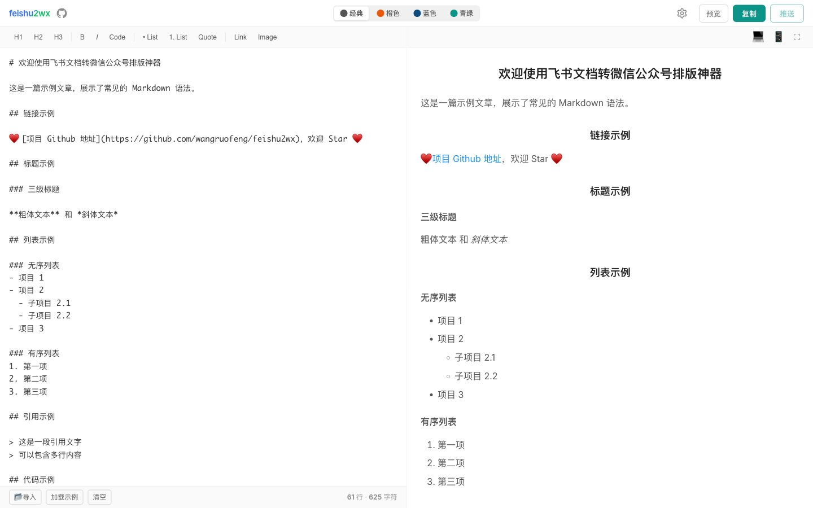

# feishu2wx v1.16：从网页排版工具到可脚本化工作流

> 这次更新给 feishu2wx 补上了 CLI、项目级配置、主题配置对齐，以及几处影响真实使用体验的微信兼容性细节。它不再只是一个“打开网页排版一下”的小工具，而开始具备进入团队内容工作流的能力。

## 背景

`feishu2wx` 最早解决的是一个很具体的问题：把飞书文档或 Markdown 内容，快速变成适合微信公众号编辑器的排版结果。这个问题本身没有变，但真实使用场景已经开始往两个方向延伸：

1. 有些用户希望继续在网页里可视化排版、预览和复制。
2. 有些用户已经习惯在本地编辑器、脚本、CI 或批量发布流程中工作，希望同一套排版规则也能在命令行里跑起来。

如果只有 Web 界面，这个工具的能力就被锁在浏览器里了。今天这次更新，本质上是在做一件事：**把原本集中在前端交互里的能力，抽成可以复用的内容处理流水线。**

项目地址：[github.com/wangruofeng/feishu2wx](https://github.com/wangruofeng/feishu2wx)



## 这次新增了什么

### 1. CLI 正式补齐

现在仓库内置了 `feishu2wx` CLI，可以直接在命令行中完成这几类操作：

- 配置和查看公众号 AppID / AppSecret
- 配置和查看主题与排版参数
- 将 Markdown 渲染为微信公众号兼容 HTML
- 导出、复制、预览 HTML
- 直接推送到公众号草稿箱

典型用法：

```bash
npm run cli -- init --project
npm run cli -- auth set --app-id <appid> --app-secret <secret>
npm run cli -- theme set blue --show-h1-underline --align-h1-left
npm run cli -- render article.md --out article.html
npm run cli -- publish article.md --title "文章标题" --cover cover.jpg
```

这意味着同一套排版能力现在可以跑在三种环境里：

- 浏览器交互
- 本地终端
- 自动化脚本 / 发布流程

### 2. 支持项目级配置

过去配置天然是“用户级”的，默认放在：

```text
~/.feishu2wx/config.json
```

这对单人使用没问题，但一旦进入项目协作或多内容仓库并行的场景，就会暴露两个问题：

- 不同项目的排版偏好会互相污染
- 很难让“这个项目应该怎么导出公众号内容”变成项目自身的一部分

现在 CLI 支持项目级配置：

```text
.feishu2wx/config.json
```

并且默认采用自动解析策略：

1. 如果当前项目存在 `.feishu2wx/config.json`，优先读取项目级配置。
2. 如果不存在，再回退到用户级配置。

也可以显式选择作用域：

```bash
npm run cli -- --project theme status
npm run cli -- --user theme status
```

这个变化看起来小，但它实际上把工具从“个人偏好面板”推进到了“项目工作流配置”。

### 3. CLI 主题配置与网页端对齐

CLI 最开始能配置主题，但还不算真正意义上的“对齐网页版”。网页端已经有一套稳定持久化的排版配置，比如：

- H1 底线
- H1 反显
- H1 左对齐
- H2 反显
- H2 左对齐
- 图片边框模式 / 圆角
- 代码块样式
- 表格阴影
- 水平分割线

现在 `feishu2wx theme status` 输出的配置项已经和网页端用于渲染/导出的配置对齐，CLI 也支持直接修改这些项。

例如：

```bash
npm run cli -- theme set blue --show-h1-underline --align-h1-left --no-table-shadow
```

这件事的价值不只是“字段补全”，而是**保证网页导出和命令行导出的结果来自同一套配置语言**。

### 4. 把 `showH1` 改名为 `showH1Underline`

这是一个很小，但很典型的工程修正。

之前项目里有一个配置项叫 `showH1`。名字看上去像“是否显示 H1 标题”，但它实际控制的是：**H1 底部那条横线是否显示**。

为了减少误解，这次把它统一改名为：

```ts
showH1Underline
```

这个重命名覆盖了：

- Web 端状态
- 组件 props
- 微信导出链路
- CLI 配置字段
- 文档

同时保留了对旧配置键的兼容读取，避免现有用户一升级就丢设置。

### 5. 微信兼容标签基线收敛

公众号编辑器没有一份完整、稳定、公开的 HTML 标签白名单。很多标签“有时能用”，但并不等于“值得依赖”。

这次我们在项目里明确了一份保守基线：

- 稳定依赖：`p`、`span`、`strong`、`em`、`ul/ol/li`、`a`、`img`、`section`、`blockquote`、`h1-h6`、`table/tr/th/td`、`hr`、`sup/sub`
- 不作为稳定能力依赖：`figure`、`figcaption`、`div`、复杂布局标签
- 不支持：`script`、`style`、`iframe`、`form`、`video`、`audio`、`canvas`

对应实现上也做了收敛：

- 预览层仍然可以保留更语义化的 `figure + figcaption`
- 微信导出层会自动降级为更稳妥的 `section + img + p.img-caption`

也就是说，我们不再把“标签语义正确”误认为“公众号里就一定稳定”。

### 6. 修复 Web 端 URL 图片预览加载问题

这个问题很容易被误判成“某个图床挂了”，但真实原因往往更细：很多远程图片服务对 `Referer` 比较敏感，浏览器默认携带的来源信息会直接导致图片请求失败。

这次在预览渲染链路里做了一个很小但很有效的修复：

```html

```

现在无论是 Markdown 图片语法，还是内联 HTML 的 ``，都会在预览层自动补上这个属性。这样对很多 URL 图片资源来说，Web 端“看起来像坏图”的问题就能直接消掉。

### 7. 部署与配置处理链路顺手补稳

除了用户直接可见的功能，这次还顺手收拾了几块边缘但重要的基础设施：

- 部署工作流更新
- 配置处理接口补齐
- 部分文档与版本说明同步

这类改动不显眼，但它们能减少后面真正发布和协作时的摩擦。

## 这次改动背后的思路

如果把这次更新拆开看，会觉得它做了很多零散的事：CLI、配置路径、参数命名、图片加载、标签兼容、部署文档……

但从架构角度看，它其实在做同一个动作：

**把“前端界面上的交互能力”，整理成“可复用、可迁移、可脚本化的内容处理能力”。**

新的处理路径可以概括为：

```text
Markdown / 飞书内容
  -> renderMarkdown()
  -> formatForWeChat()
  -> Web 预览 / 剪贴板 / HTML 文件 / 草稿箱推送
```

也正因为这条链路被收得更清晰，CLI 才不是“额外再写一套命令行功能”，而是复用现有排版与导出逻辑的另一层入口。

## 对使用者意味着什么

如果你是单人内容作者，这次更新最直接的收益是：

- 可以继续用网页界面排版
- 也可以把常用配置沉淀到项目里
- 图片预览会更稳，复制到公众号的结构也更可控

如果你是团队协作者或技术内容负责人，这次更新带来的变化更明显：

- 你可以把公众号排版流程纳入仓库
- 你可以把主题配置变成项目资产
- 你可以把“渲染、导出、发布”写进脚本，而不是要求每个人都手工点界面

## 写在最后

很多工具一开始都只解决一个局部问题：能不能用，能不能快一点，能不能少复制几次。

而一个工具真正开始成熟，通常不是因为它“功能更多了”，而是因为它开始能进入更真实的工作流：可配置、可复用、可自动化、可解释。

这次的 feishu2wx 更像是在完成这样一次跨越。

如果你原本把它当成一个网页排版小工具，现在可以重新看它一眼了。

---

*本文基于 feishu2wx 今日新增的 CLI、项目级配置、主题配置对齐与微信兼容性修复整理。*
